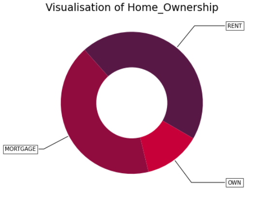
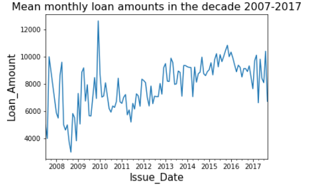
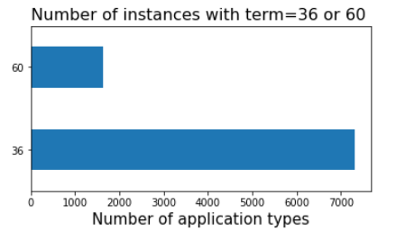
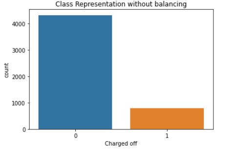
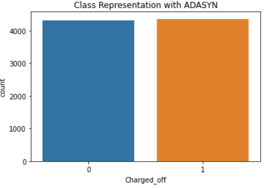
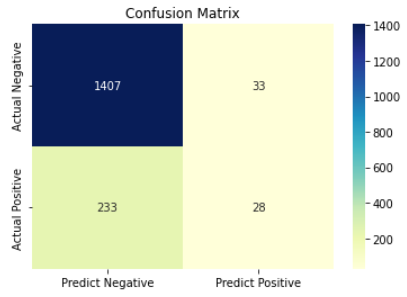
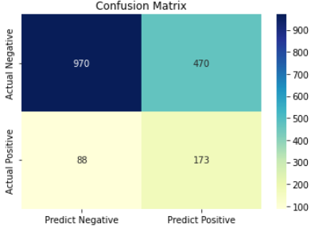
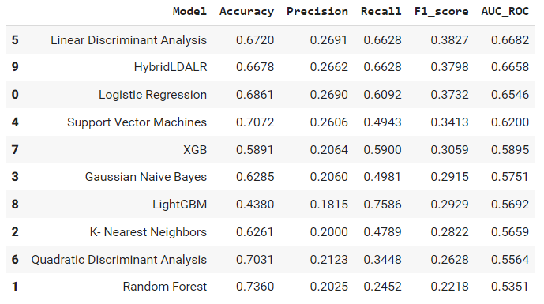

# Machine_Learning_for_Finance1
COMP0050 Module - Assignment 1 @UCL  
✨ Binary Classification for unbalanced dataset  
✨ Loan defaults detection  
✨ SMOTE, Borderline-SMOTE, ADASYN  
✨ Comparative analysis of classifiers  
!! Machine Learning section not available at the moment (due to confidentiality)  

Some of the results produced in the statistical analysis were the following:  
 
  
  
  
The next step was balancing the underepresented default class:  
 
  
  
The performances of the Linear Discriminant Analysis binary classifier on unbalanced and ADASYN-balanced training sets are compared below :  
 
  
  
A collective table that compares all results along with a hybrid model is illustrated below:  
 
  
